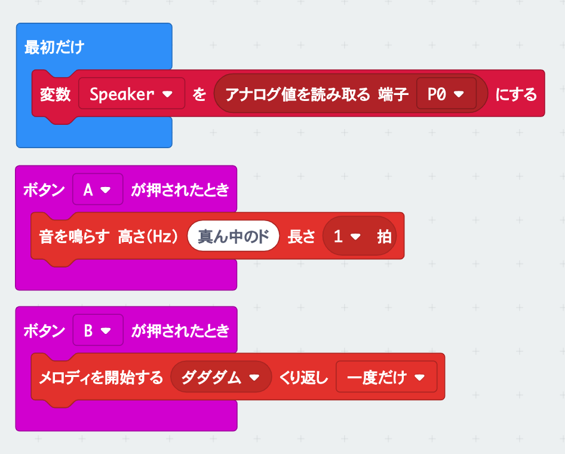
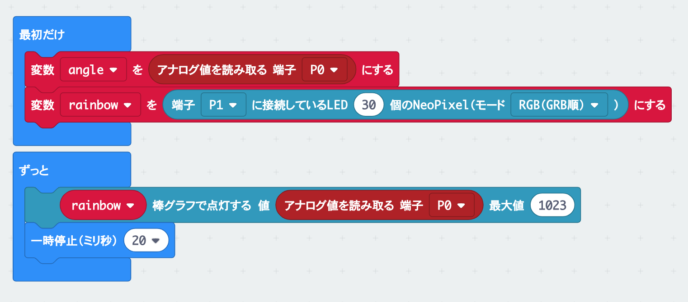

# micro:bit ワークショップ（中級編） - Grove Inventor Kitを使用したプログラミング

このドキュメントは、micro:bitとSeeed Grove Inventor Kit付属のセンサーを使ったワークショップの説明資料です。以下の手順を読んで、プログラムを作成してみましょう。
micro:bitの基本的な使い方は、[ここ](https://microbit.org/ja/guide/quick/)をご覧ください。

## 使用する機材

* micro:bit 本体
* Seeed Grove Inventor Kit

## 1. LEDを点灯させる

### 使用する部品
* Grove - Red LED（P0/P14に接続）

### プログラム


[プログラムへのリンク](https://makecode.microbit.org/v1/_MkrRTPPrhira)

## 2. ライトセンサーを使用する

### 使用する部品
* Grove - Light Sensor（P0/P14に接続）

### プログラム


[プログラムへのリンク](https://makecode.microbit.org/v1/_JmEg2PauwY9j)

## 3. アナログ入力を扱う

### 使用する部品
* Grove - Rotary Angle Sensor(P)（P0/P14に接続）

### プログラム


[プログラムへのリンク](https://makecode.microbit.org/v1/_LR2czf8pbgUK)

## 4. スピーカーで音を出す

### 使用する部品
* Grove - Speaker（P0/P14に接続）

### プログラム


[プログラムへのリンク](https://makecode.microbit.org/v1/_bMxXEuefL56W)

## 5. ジェスチャーセンサーを使う

```高度なブロック``` - ```パッケージを追加する``` から、```grove```で検索して表示されるパッケージを追加する。

### 使用する部品
* Grove - Gesture（I2Cに接続）

### プログラム


[プログラムへのリンク](https://makecode.microbit.org/v1/_Xc3a290uECbv)

## 6. 超音波センサーで距離を測る

```高度なブロック``` - ```パッケージを追加する``` から、```grove```で検索して表示されるパッケージを追加する。

### 使用する部品
* Grove - Ultrasonic Ranger（P0/P14に接続）
* Grove - 4-Digit Display（P1/P15に接続）

### プログラム


[プログラムへのリンク](https://makecode.microbit.org/v1/_9hHLrz4RR7u6)


## 7. LEDテープ（NeoPixel）を使用する

```高度なブロック``` - ```パッケージを追加する``` から、```neopixel```パッケージを追加する。

### 使用する部品
* Grove - Rotary Angle Sensor(P)（P0/P14に接続）
* Grove - WS2812b NeoPixel LEDテープ（P1/P15に接続）

### プログラム


[プログラムへのリンク](https://makecode.microbit.org/v1/_3fV9c8KLM4bx)

## 8. LEDテープにアナログ値を表示する

```高度なブロック``` - ```パッケージを追加する``` から、```neopixel```パッケージを追加する。

### 使用する部品
* Grove - Rotary Angle Sensor(P)（P0/P14に接続）
* Grove - WS2812b NeoPixel LEDテープ（P1/P15に接続）

### プログラム


[プログラムへのリンク](https://makecode.microbit.org/v1/_FbvH1Uf7weXY)

## 9. センサーを組み合わせてプログラムを作る

### 使用する部品
* 自由に選んで下さい

### プログラム
センサーを組み合わせて、色々なプログラムを作成してみましょう。

例）
* 人が近づいたときに反応する装置
* オリジナル電子楽器
* 衝突防止装置
* 次世代型目覚まし時計
