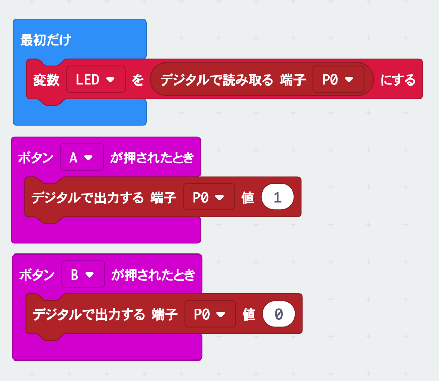
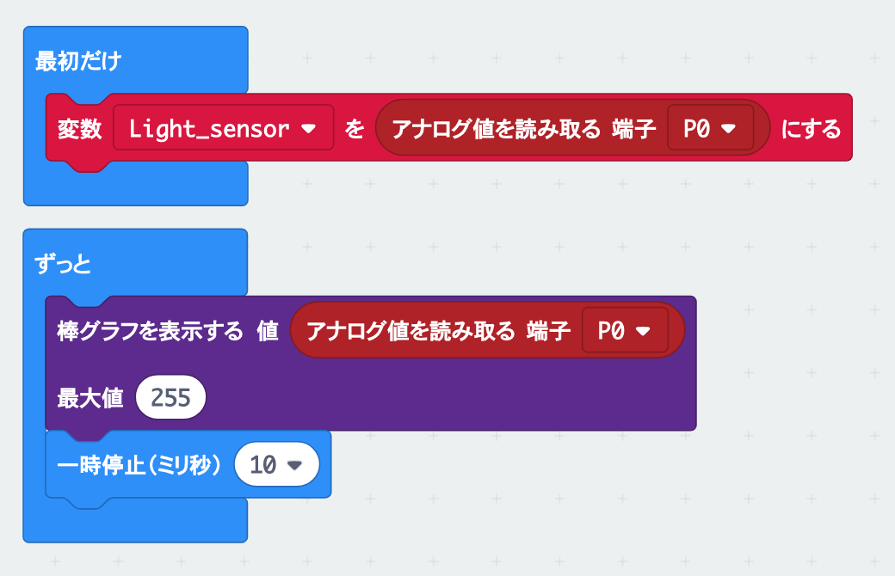

# micro:bit ワークショップ（中級編） - Grove Inventor Kitを使用したプログラミング

micro:bitとSeeed Grove Inventor Kit付属のセンサーを使ったワークショップです。

## 機材

* micro:bit 本体
* Seeed Grove Inventor Kit

## LEDを点灯させる

### 使用する部品
* Grove - Red LED（P0/P14に接続）

### プログラム


## ライトセンサーを使用する

### 使用する部品
* Grove - Light Sensor（P0/P14に接続）

### プログラム


## アナログ入力を扱う

### 使用する部品
* Grove - Rotary Angle Sensor(P)（P0/P14に接続）

### プログラム


## スピーカーで音を出す

### 使用する部品
* Grove - Speaker（P0/P14に接続）

### プログラム


## ジェスチャーセンサーを使う

### 使用する部品
* Grove - Gesture（I2Cに接続）

### プログラム


## 超音波センサーで距離を測る

### 使用する部品
* Grove - Ultrasonic Ranger（P0/P14に接続）

### プログラム


## 超音波センサーで測定した距離を表示する

```高度なブロック``` - ```パッケージを追加する``` から、```grove```で検索して表示されるパッケージを追加する。

### 使用する部品
* Grove - Ultrasonic Ranger（P0/P14に接続）
* Grove - 4-Digit Display（P1/P15に接続）

### プログラム


## LEDテープ（NeoPixel）を使用する

```高度なブロック``` - ```パッケージを追加する``` から、```neopixel```パッケージを追加する。

### 使用する部品
* Grove - Rotary Angle Sensor(P)（P0/P14に接続）
* Grove - WS2812b NeoPixel LEDテープ（P1/P15に接続）

### プログラム


## LEDテープにアナログ値を表示する

### 使用する部品
* Grove - Rotary Angle Sensor(P)（P0/P14に接続）
* Grove - WS2812b NeoPixel LEDテープ（P1/P15に接続）

### プログラム


## センサーを組み合わせてプログラムを作る

### 使用する部品
* 自由に選んで下さい

### プログラム
センサーを組み合わせて、色々なプログラムを作成してみましょう。

例）
* 人が近づいたときに反応する装置
* 